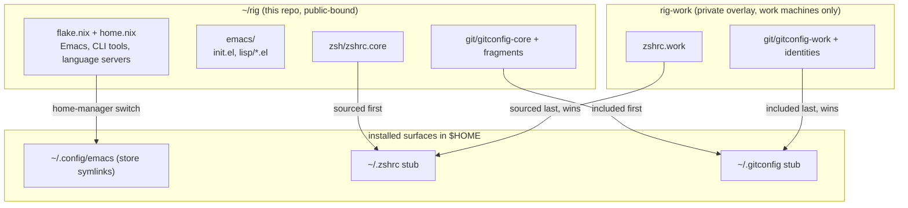
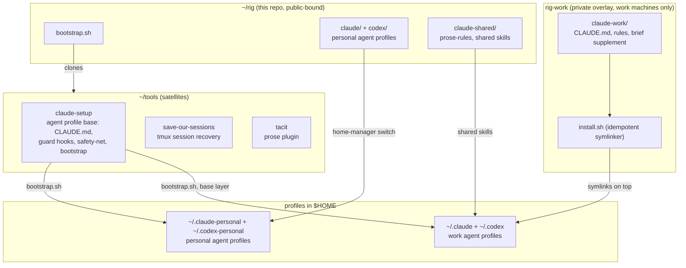

# Architecture

How this repo (`rig`), its satellites, and the private work overlay
(`rig-work`) compose into one machine setup. The core repo is public-safe;
anything employer-specific lives in the overlay, which is present only on work
machines and always wins by loading last.

Two views, both flowing top to bottom from source repos to installed surfaces.

## Shell, git and Emacs config

## Agent profiles

Layering rules:

- The core repo never contains client names, internal hostnames, or secrets.
  The overlay repo holds all of those and is never public.
- Overlay config always loads after core config, so work settings win on work
  machines and their absence is harmless everywhere else.
- Agent profiles follow the same pattern as the shell: `claude-setup` installs
  the shared base into each profile dir, then the overlay's `install.sh`
  symlinks work-specific instructions and rules on top.
- Machine-local, uncommitted state (Emacs `~/.config/emacs-local/`, secrets in
  1Password) sits outside all three repos.
